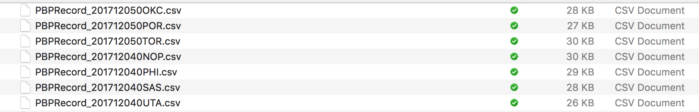
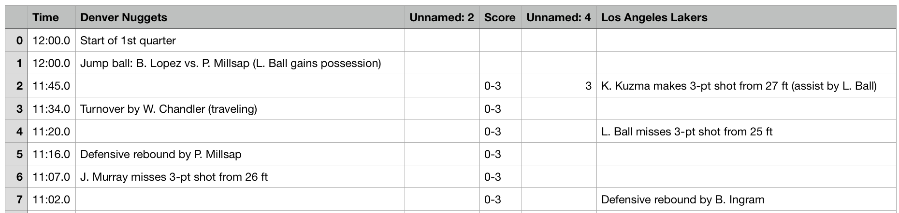

```python
# Let us import the main code function with all of it's libraries
exec(open("Function.py").read())
%matplotlib inline
```


## Model Description

To generate the model and keep the code organized, we have created a class `NBAWinProbability()`, that takes on arguments for the whether to include the team statistics in the model, the seasons of interest and the folder for where to keep the data. To begin using the model we must call the instance and pass along the arguments as seen below. We can also use the default arguments that are included in the function. Here instead of considering all seasons from 2013 to 2018, we consider only this year's season for ilustration. 


```python
Model=NBAWinProbability(Seasons=[2018])
```


## Scraping website for Data
To scrape for the data, we use the built in function `ScrapeData()`. This will go to the seasons requested above and will generate data in the Data folder for each game. It will also create a list of *.csv*, each of them will contain the play-by-play data of a certain game. Also, don't worry about running it twice. The function is smart enough to recognize that files in the folder exist. So if for some reason the internet connection is dropped, just run it again and it will pick up where it left off.


```python
Model.ScrapeData()
```


    Creating Data CSV 0.2840909090909091% Completed
    Creating Data CSV 0.5681818181818182% Completed
    Creating Data CSV 0.8522727272727272% Completed
    Creating Data CSV 1.1363636363636365% Completed
    Creating Data CSV 1.4204545454545454% Completed
    Creating Data CSV 1.7045454545454544% Completed
    Creating Data CSV 1.9886363636363635% Completed
    Creating Data CSV 2.272727272727273% Completed
    Creating Data CSV 2.556818181818182% Completed
    Creating Data CSV 2.840909090909091% Completed
    Creating Data CSV 3.125% Completed
    Creating Data CSV 3.4090909090909087% Completed
    Creating Data CSV 3.6931818181818183% Completed
    Creating Data CSV 3.977272727272727% Completed
    Creating Data CSV 4.261363636363636% Completed
    Creating Data CSV 4.545454545454546% Completed
    Creating Data CSV 4.829545454545454% Completed
    Creating Data CSV 5.113636363636364% Completed
    Creating Data CSV 5.3977272727272725% Completed
    Creating Data CSV 5.681818181818182% Completed
    Creating Data CSV 5.965909090909091% Completed
    Creating Data CSV 6.25% Completed
    Creating Data CSV 6.534090909090909% Completed
    Creating Data CSV 6.8181818181818175% Completed
    Creating Data CSV 7.1022727272727275% Completed
    Creating Data CSV 7.386363636363637% Completed
    Creating Data CSV 7.670454545454546% Completed
    Creating Data CSV 7.954545454545454% Completed
    Creating Data CSV 8.238636363636363% Completed
    Creating Data CSV 8.522727272727272% Completed
    Creating Data CSV 8.806818181818182% Completed
    Creating Data CSV 9.090909090909092% Completed
    Creating Data CSV 9.375% Completed
    Creating Data CSV 9.659090909090908% Completed
    Creating Data CSV 9.943181818181818% Completed
    Creating Data CSV 10.227272727272728% Completed
    Creating Data CSV 10.511363636363637% Completed
    Creating Data CSV 10.795454545454545% Completed
    Creating Data CSV 11.079545454545455% Completed
    Creating Data CSV 11.363636363636363% Completed
    Creating Data CSV 11.647727272727272% Completed
    Creating Data CSV 11.931818181818182% Completed
    Creating Data CSV 12.215909090909092% Completed
    Creating Data CSV 12.5% Completed
    Creating Data CSV 12.784090909090908% Completed
    Creating Data CSV 13.068181818181818% Completed
    Creating Data CSV 13.352272727272727% Completed
    Creating Data CSV 13.636363636363635% Completed
    Creating Data CSV 13.920454545454545% Completed
    Creating Data CSV 14.204545454545455% Completed
    Creating Data CSV 14.488636363636365% Completed
    Creating Data CSV 14.772727272727273% Completed
    Creating Data CSV 15.056818181818182% Completed
    Creating Data CSV 15.340909090909092% Completed
    Creating Data CSV 15.625% Completed
    Creating Data CSV 15.909090909090908% Completed
    Creating Data CSV 16.193181818181817% Completed
    Creating Data CSV 16.477272727272727% Completed
    Creating Data CSV 16.761363636363637% Completed
    Creating Data CSV 17.045454545454543% Completed
    Creating Data CSV 17.329545454545457% Completed
    Creating Data CSV 17.613636363636363% Completed
    Creating Data CSV 17.897727272727273% Completed
    Creating Data CSV 18.181818181818183% Completed
    Creating Data CSV 18.46590909090909% Completed
    Creating Data CSV 18.75% Completed
    Creating Data CSV 19.03409090909091% Completed
    Creating Data CSV 19.318181818181817% Completed
    Creating Data CSV 19.602272727272727% Completed
    Creating Data CSV 19.886363636363637% Completed
    Creating Data CSV 20.170454545454543% Completed
    Creating Data CSV 20.454545454545457% Completed
    Creating Data CSV 20.738636363636363% Completed
    Creating Data CSV 21.022727272727273% Completed
    Creating Data CSV 21.306818181818183% Completed
    Creating Data CSV 21.59090909090909% Completed
    Creating Data CSV 21.875% Completed
    Creating Data CSV 22.15909090909091% Completed
    Creating Data CSV 22.443181818181817% Completed
    Creating Data CSV 22.727272727272727% Completed
    Creating Data CSV 23.011363636363637% Completed
    Creating Data CSV 23.295454545454543% Completed
    Creating Data CSV 23.579545454545457% Completed
    Creating Data CSV 23.863636363636363% Completed
    Creating Data CSV 24.147727272727273% Completed
    Creating Data CSV 24.431818181818183% Completed
    Creating Data CSV 24.71590909090909% Completed
    Creating Data CSV 25.0% Completed
    Creating Data CSV 25.28409090909091% Completed
    Creating Data CSV 25.568181818181817% Completed
    Creating Data CSV 25.85227272727273% Completed
    Creating Data CSV 26.136363636363637% Completed
    Creating Data CSV 26.420454545454547% Completed
    Creating Data CSV 26.704545454545453% Completed
    Creating Data CSV 26.988636363636363% Completed
    Creating Data CSV 27.27272727272727% Completed
    Creating Data CSV 27.556818181818183% Completed
    Creating Data CSV 27.84090909090909% Completed
    Creating Data CSV 28.125% Completed
    Creating Data CSV 28.40909090909091% Completed
    Creating Data CSV 28.693181818181817% Completed
    Creating Data CSV 28.97727272727273% Completed
    Creating Data CSV 29.261363636363637% Completed
    Creating Data CSV 29.545454545454547% Completed
    Creating Data CSV 29.829545454545453% Completed
    Creating Data CSV 30.113636363636363% Completed
    Creating Data CSV 30.39772727272727% Completed
    Creating Data CSV 30.681818181818183% Completed
    Creating Data CSV 30.96590909090909% Completed
    Creating Data CSV 31.25% Completed
    Creating Data CSV 31.53409090909091% Completed
    Creating Data CSV 31.818181818181817% Completed
    Creating Data CSV 32.10227272727273% Completed
    Creating Data CSV 32.38636363636363% Completed
    Creating Data CSV 32.67045454545455% Completed
    Creating Data CSV 32.95454545454545% Completed
    Creating Data CSV 33.23863636363637% Completed
    Creating Data CSV 33.52272727272727% Completed
    Creating Data CSV 33.80681818181818% Completed
    Creating Data CSV 34.090909090909086% Completed
    Creating Data CSV 34.375% Completed
    Creating Data CSV 34.659090909090914% Completed
    Creating Data CSV 34.94318181818182% Completed
    Creating Data CSV 35.22727272727273% Completed
    Creating Data CSV 35.51136363636363% Completed
    Creating Data CSV 35.79545454545455% Completed
    Creating Data CSV 36.07954545454545% Completed
    Creating Data CSV 36.36363636363637% Completed
    Creating Data CSV 36.64772727272727% Completed
    Creating Data CSV 36.93181818181818% Completed
    Creating Data CSV 37.215909090909086% Completed
    Creating Data CSV 37.5% Completed
    Creating Data CSV 37.784090909090914% Completed
    Creating Data CSV 38.06818181818182% Completed
    Creating Data CSV 38.35227272727273% Completed
    Creating Data CSV 38.63636363636363% Completed
    Creating Data CSV 38.92045454545455% Completed
    Creating Data CSV 39.20454545454545% Completed
    Creating Data CSV 39.48863636363637% Completed
    Creating Data CSV 39.77272727272727% Completed
    Creating Data CSV 40.05681818181818% Completed
    Creating Data CSV 40.340909090909086% Completed
    Creating Data CSV 40.625% Completed
    Creating Data CSV 40.909090909090914% Completed
    Creating Data CSV 41.19318181818182% Completed
    Creating Data CSV 41.47727272727273% Completed
    Creating Data CSV 41.76136363636363% Completed
    Creating Data CSV 42.04545454545455% Completed
    Creating Data CSV 42.32954545454545% Completed
    Creating Data CSV 42.61363636363637% Completed
    Creating Data CSV 42.89772727272727% Completed
    Creating Data CSV 43.18181818181818% Completed
    Creating Data CSV 43.465909090909086% Completed
    Creating Data CSV 43.75% Completed
    Creating Data CSV 44.034090909090914% Completed
    Creating Data CSV 44.31818181818182% Completed
    Creating Data CSV 44.60227272727273% Completed
    Creating Data CSV 44.88636363636363% Completed
    Creating Data CSV 45.17045454545455% Completed
    Creating Data CSV 45.45454545454545% Completed
    Creating Data CSV 45.73863636363637% Completed
    Creating Data CSV 46.02272727272727% Completed
    Creating Data CSV 46.30681818181818% Completed
    Creating Data CSV 46.590909090909086% Completed
    Creating Data CSV 46.875% Completed
    Creating Data CSV 47.159090909090914% Completed
    Creating Data CSV 47.44318181818182% Completed
    Creating Data CSV 47.72727272727273% Completed
    Creating Data CSV 48.01136363636363% Completed
    Creating Data CSV 48.29545454545455% Completed
    Creating Data CSV 48.57954545454545% Completed
    Creating Data CSV 48.86363636363637% Completed
    Creating Data CSV 49.14772727272727% Completed
    Creating Data CSV 49.43181818181818% Completed
    Creating Data CSV 49.715909090909086% Completed
    Creating Data CSV 50.0% Completed
    Creating Data CSV 50.28409090909091% Completed
    Creating Data CSV 50.56818181818182% Completed
    Creating Data CSV 50.85227272727273% Completed
    Creating Data CSV 51.13636363636363% Completed
    Creating Data CSV 51.42045454545454% Completed
    Creating Data CSV 51.70454545454546% Completed
    Creating Data CSV 51.98863636363637% Completed
    Creating Data CSV 52.27272727272727% Completed
    Creating Data CSV 52.55681818181818% Completed
    Creating Data CSV 52.84090909090909% Completed
    Creating Data CSV 53.125% Completed
    Creating Data CSV 53.40909090909091% Completed
    Creating Data CSV 53.69318181818182% Completed
    Creating Data CSV 53.97727272727273% Completed
    Creating Data CSV 54.26136363636363% Completed
    Creating Data CSV 54.54545454545454% Completed
    Creating Data CSV 54.82954545454546% Completed
    Creating Data CSV 55.11363636363637% Completed
    Creating Data CSV 55.39772727272727% Completed
    Creating Data CSV 55.68181818181818% Completed
    Creating Data CSV 55.96590909090909% Completed
    Creating Data CSV 56.25% Completed
    Creating Data CSV 56.53409090909091% Completed
    Creating Data CSV 56.81818181818182% Completed
    Creating Data CSV 57.10227272727273% Completed
    Creating Data CSV 57.38636363636363% Completed
    Creating Data CSV 57.67045454545454% Completed
    Creating Data CSV 57.95454545454546% Completed
    Creating Data CSV 58.23863636363637% Completed
    Creating Data CSV 58.52272727272727% Completed
    Creating Data CSV 58.80681818181818% Completed
    Creating Data CSV 59.09090909090909% Completed
    Creating Data CSV 59.375% Completed
    Creating Data CSV 59.65909090909091% Completed
    Creating Data CSV 59.94318181818182% Completed
    Creating Data CSV 60.22727272727273% Completed
    Creating Data CSV 60.51136363636363% Completed
    Creating Data CSV 60.79545454545454% Completed
    Creating Data CSV 61.07954545454546% Completed
    Creating Data CSV 61.36363636363637% Completed
    Creating Data CSV 61.64772727272727% Completed
    Creating Data CSV 61.93181818181818% Completed
    Creating Data CSV 62.21590909090909% Completed
    Creating Data CSV 62.5% Completed
    Creating Data CSV 62.78409090909091% Completed
    Creating Data CSV 63.06818181818182% Completed
    Creating Data CSV 63.35227272727273% Completed
    Creating Data CSV 63.63636363636363% Completed
    Creating Data CSV 63.92045454545454% Completed
    Creating Data CSV 64.20454545454545% Completed
    Creating Data CSV 64.48863636363636% Completed
    Creating Data CSV 64.77272727272727% Completed
    Creating Data CSV 65.05681818181817% Completed
    Creating Data CSV 65.3409090909091% Completed
    Creating Data CSV 65.625% Completed
    Creating Data CSV 65.9090909090909% Completed
    Creating Data CSV 66.19318181818183% Completed
    Creating Data CSV 66.47727272727273% Completed
    Creating Data CSV 66.76136363636364% Completed
    Creating Data CSV 67.04545454545455% Completed
    Creating Data CSV 67.32954545454545% Completed
    Creating Data CSV 67.61363636363636% Completed
    Creating Data CSV 67.89772727272727% Completed
    Creating Data CSV 68.18181818181817% Completed
    Creating Data CSV 68.4659090909091% Completed
    Creating Data CSV 68.75% Completed
    Creating Data CSV 69.0340909090909% Completed
    Creating Data CSV 69.31818181818183% Completed
    Creating Data CSV 69.60227272727273% Completed
    Creating Data CSV 69.88636363636364% Completed
    Creating Data CSV 70.17045454545455% Completed
    Creating Data CSV 70.45454545454545% Completed
    Creating Data CSV 70.73863636363636% Completed
    Creating Data CSV 71.02272727272727% Completed
    Creating Data CSV 71.30681818181817% Completed
    Creating Data CSV 71.5909090909091% Completed
    Creating Data CSV 71.875% Completed
    Creating Data CSV 72.1590909090909% Completed
    Creating Data CSV 72.44318181818183% Completed
    Creating Data CSV 72.72727272727273% Completed
    Creating Data CSV 73.01136363636364% Completed
    Creating Data CSV 73.29545454545455% Completed
    Creating Data CSV 73.57954545454545% Completed
    Creating Data CSV 73.86363636363636% Completed
    Creating Data CSV 74.14772727272727% Completed
    Creating Data CSV 74.43181818181817% Completed
    Creating Data CSV 74.7159090909091% Completed
    Creating Data CSV 75.0% Completed
    Creating Data CSV 75.2840909090909% Completed
    Creating Data CSV 75.56818181818183% Completed
    Creating Data CSV 75.85227272727273% Completed
    Creating Data CSV 76.13636363636364% Completed
    Creating Data CSV 76.42045454545455% Completed
    Creating Data CSV 76.70454545454545% Completed
    Creating Data CSV 76.98863636363636% Completed
    Creating Data CSV 77.27272727272727% Completed
    Creating Data CSV 77.55681818181817% Completed
    Creating Data CSV 77.8409090909091% Completed
    Creating Data CSV 78.125% Completed
    Creating Data CSV 78.4090909090909% Completed
    Creating Data CSV 78.69318181818183% Completed
    Creating Data CSV 78.97727272727273% Completed
    Creating Data CSV 79.26136363636364% Completed
    Creating Data CSV 79.54545454545455% Completed
    Creating Data CSV 79.82954545454545% Completed
    Creating Data CSV 80.11363636363636% Completed
    Creating Data CSV 80.39772727272727% Completed
    Creating Data CSV 80.68181818181817% Completed
    Creating Data CSV 80.9659090909091% Completed
    Creating Data CSV 81.25% Completed
    Creating Data CSV 81.5340909090909% Completed
    Creating Data CSV 81.81818181818183% Completed
    Creating Data CSV 82.10227272727273% Completed
    Creating Data CSV 82.38636363636364% Completed
    Creating Data CSV 82.67045454545455% Completed
    Creating Data CSV 82.95454545454545% Completed
    Creating Data CSV 83.23863636363636% Completed
    Creating Data CSV 83.52272727272727% Completed
    Creating Data CSV 83.80681818181817% Completed
    Creating Data CSV 84.0909090909091% Completed
    Creating Data CSV 84.375% Completed
    Creating Data CSV 84.6590909090909% Completed
    Creating Data CSV 84.94318181818183% Completed
    Creating Data CSV 85.22727272727273% Completed
    Creating Data CSV 85.51136363636364% Completed
    Creating Data CSV 85.79545454545455% Completed
    Creating Data CSV 86.07954545454545% Completed
    Creating Data CSV 86.36363636363636% Completed
    Creating Data CSV 86.64772727272727% Completed
    Creating Data CSV 86.93181818181817% Completed
    Creating Data CSV 87.2159090909091% Completed
    Creating Data CSV 87.5% Completed
    Creating Data CSV 87.7840909090909% Completed
    Creating Data CSV 88.06818181818183% Completed
    Creating Data CSV 88.35227272727273% Completed
    Creating Data CSV 88.63636363636364% Completed
    Creating Data CSV 88.92045454545455% Completed
    Creating Data CSV 89.20454545454545% Completed
    Creating Data CSV 89.48863636363636% Completed
    Creating Data CSV 89.77272727272727% Completed
    Creating Data CSV 90.05681818181817% Completed
    Creating Data CSV 90.3409090909091% Completed
    Creating Data CSV 90.625% Completed
    Creating Data CSV 90.9090909090909% Completed
    Creating Data CSV 91.19318181818183% Completed
    Creating Data CSV 91.47727272727273% Completed
    Creating Data CSV 91.76136363636364% Completed
    Creating Data CSV 92.04545454545455% Completed
    Creating Data CSV 92.32954545454545% Completed
    Creating Data CSV 92.61363636363636% Completed
    Creating Data CSV 92.89772727272727% Completed
    Creating Data CSV 93.18181818181817% Completed
    Creating Data CSV 93.4659090909091% Completed
    Creating Data CSV 93.75% Completed
    Creating Data CSV 94.0340909090909% Completed
    Creating Data CSV 94.31818181818183% Completed
    Creating Data CSV 94.60227272727273% Completed
    Creating Data CSV 94.88636363636364% Completed
    Creating Data CSV 95.17045454545455% Completed
    Creating Data CSV 95.45454545454545% Completed
    Creating Data CSV 95.73863636363636% Completed
    Creating Data CSV 96.02272727272727% Completed
    Creating Data CSV 96.30681818181817% Completed
    Creating Data CSV 96.5909090909091% Completed
    Creating Data CSV 96.875% Completed
    Creating Data CSV 97.1590909090909% Completed
    Creating Data CSV 97.44318181818183% Completed
    Creating Data CSV 97.72727272727273% Completed
    Creating Data CSV 98.01136363636364% Completed
    Creating Data CSV 98.29545454545455% Completed
    Creating Data CSV 98.57954545454545% Completed
    Creating Data CSV 98.86363636363636% Completed
    Creating Data CSV 99.14772727272727% Completed
    Creating Data CSV 99.43181818181817% Completed
    Creating Data CSV 99.7159090909091% Completed
    Creating Data CSV 100.0% Completed
    Scrape Data Completed!


The generated **list of files** look like following:


Inside each *.csv* file there is in detailed **play by play** data,


## Generating Features

With the list of play by play data, we need to transform them into features that can be trained by ML models. From the data sheet we can extract four types of important information: the **time remaining**, **the name of two teams**, **their scores** and **events in string**. In events, there are many informations: we know which team makes a 2-pts shoot, we know which turns the ball over, we know which team fouls, and we know which team calls the timeout. Beyond that, throughout the game, we can have the **accumulated values as well**, based on the previous information. More specifically, we are able to know the total amount of offensive rebound the team has grabbed, the 2-pt shooting makes, 2-pt shooting rates, total timeouts used at a **certain point of the game**. (see details in EDA part, add link)


In order to to have to do the processing of the features mulitiple times, we generate the features and imediatelly put them into a .csv file for easy import and readability. To generate the features we call on the existing files that are in the Data folder obtained in the last step during scraping. If the include teams statistics option is enabeled, the folder must also contain the team statistics information in the team_stats folder. This folder contains manually scraped data, which is copy pasted. The website that contains this data usese difficult-to-scrape technology, so we had to manually copy and paste the table into a csv file. This function ultimately generates a .csv file that contains all of the information necessary for training and predicting in the model. 


```python
Model.CreateAllFeaturesCSV()
```


    Creating Feature 0.2840909090909091% Completed
    201710170CLE
    Creating Feature 0.5681818181818182% Completed
    201710170GSW
    Creating Feature 0.8522727272727272% Completed
    201710180BOS
    Creating Feature 1.1363636363636365% Completed
    201710180DAL
    Creating Feature 1.4204545454545454% Completed
    201710180DET
    Creating Feature 1.7045454545454544% Completed
    201710180IND
    Creating Feature 1.9886363636363635% Completed
    201710180MEM
    Creating Feature 2.272727272727273% Completed
    201710180ORL
    Creating Feature 2.556818181818182% Completed
    201710180PHO
    Creating Feature 2.840909090909091% Completed
    201710180SAC
    Creating Feature 3.125% Completed
    201710180SAS
    Creating Feature 3.4090909090909087% Completed
    201710180UTA
    Creating Feature 3.6931818181818183% Completed
    201710180WAS
    Creating Feature 3.977272727272727% Completed
    201710190LAL
    Creating Feature 4.261363636363636% Completed
    201710190OKC
    Creating Feature 4.545454545454546% Completed
    201710190TOR
    Creating Feature 4.829545454545454% Completed
    201710200BRK
    Creating Feature 5.113636363636364% Completed
    201710200CHO
    Creating Feature 5.3977272727272725% Completed
    201710200DAL
    Creating Feature 5.681818181818182% Completed
    201710200IND
    Creating Feature 5.965909090909091% Completed
    201710200MIL
    Creating Feature 6.25% Completed
    201710200MIN
    Creating Feature 6.534090909090909% Completed
    201710200NOP
    Creating Feature 6.8181818181818175% Completed
    201710200PHI
    Creating Feature 7.1022727272727275% Completed
    201710200PHO
    Creating Feature 7.386363636363637% Completed
    201710200WAS
    Creating Feature 7.670454545454546% Completed
    201710210CHI
    Creating Feature 7.954545454545454% Completed
    201710210CLE
    Creating Feature 8.238636363636363% Completed
    201710210DEN
    Creating Feature 8.522727272727272% Completed
    201710210HOU
    Creating Feature 8.806818181818182% Completed
    201710210LAC
    Creating Feature 9.090909090909092% Completed
    201710210MEM
    Creating Feature 9.375% Completed
    201710210MIA
    Creating Feature 9.659090909090908% Completed
    201710210MIL
    Creating Feature 9.943181818181818% Completed
    201710210NYK
    Creating Feature 10.227272727272728% Completed
    201710210TOR
    Creating Feature 10.511363636363637% Completed
    201710210UTA
    Creating Feature 10.795454545454545% Completed
    201710220BRK
    Creating Feature 11.079545454545455% Completed
    201710220LAL
    Creating Feature 11.363636363636363% Completed
    201710220OKC
    Creating Feature 11.647727272727272% Completed
    201710230DAL
    Creating Feature 11.931818181818182% Completed
    201710230DEN
    Creating Feature 12.215909090909092% Completed
    201710230DET
    Creating Feature 12.5% Completed
    201710230HOU
    Creating Feature 12.784090909090908% Completed
    201710230MIA
    Creating Feature 13.068181818181818% Completed
    201710230MIL
    Creating Feature 13.352272727272727% Completed
    201710230PHO
    Creating Feature 13.636363636363635% Completed
    201710230SAS
    Creating Feature 13.920454545454545% Completed
    201710240BOS
    Creating Feature 14.204545454545455% Completed
    201710240CLE
    Creating Feature 14.488636363636365% Completed
    201710240LAC
    Creating Feature 14.772727272727273% Completed
    201710240MIN
    Creating Feature 15.056818181818182% Completed
    201710240ORL
    Creating Feature 15.340909090909092% Completed
    201710240POR
    Creating Feature 15.625% Completed
    201710250BRK
    Creating Feature 15.909090909090908% Completed
    201710250CHO
    Creating Feature 16.193181818181817% Completed
    201710250DAL
    Creating Feature 16.477272727272727% Completed
    201710250DET
    Creating Feature 16.761363636363637% Completed
    201710250GSW
    Creating Feature 17.045454545454543% Completed
    201710250LAL
    Start of 1st overtime
    Creating Feature 17.329545454545457% Completed
    201710250MIA
    Creating Feature 17.613636363636363% Completed
    201710250OKC
    Creating Feature 17.897727272727273% Completed
    201710250PHI
    Creating Feature 18.181818181818183% Completed
    201710250PHO
    Creating Feature 18.46590909090909% Completed
    201710260CHI
    Creating Feature 18.75% Completed
    201710260MEM
    Creating Feature 19.03409090909091% Completed
    201710260MIL
    Creating Feature 19.318181818181817% Completed
    201710260POR
    Creating Feature 19.602272727272727% Completed
    201710260SAC
    Creating Feature 19.886363636363637% Completed
    201710270ATL
    Creating Feature 20.170454545454543% Completed
    201710270CHO
    Creating Feature 20.454545454545457% Completed
    201710270GSW
    Creating Feature 20.738636363636363% Completed
    201710270LAL
    Creating Feature 21.022727272727273% Completed
    201710270MIN
    Creating Feature 21.306818181818183% Completed
    201710270NYK
    Creating Feature 21.59090909090909% Completed
    201710270ORL
    Creating Feature 21.875% Completed
    201710280CHI
    Creating Feature 22.15909090909091% Completed
    201710280DAL
    Creating Feature 22.443181818181817% Completed
    201710280LAC
    Creating Feature 22.727272727272727% Completed
    201710280MEM
    Creating Feature 23.011363636363637% Completed
    201710280MIA
    Creating Feature 23.295454545454543% Completed
    201710280NOP
    Creating Feature 23.579545454545457% Completed
    201710280POR
    Creating Feature 23.863636363636363% Completed
    201710280UTA
    Creating Feature 24.147727272727273% Completed
    201710290ATL
    Creating Feature 24.431818181818183% Completed
    201710290BRK
    Creating Feature 24.71590909090909% Completed
    201710290CHO
    Creating Feature 25.0% Completed
    201710290CLE
    Creating Feature 25.28409090909091% Completed
    201710290GSW
    Creating Feature 25.568181818181817% Completed
    201710290IND
    Creating Feature 25.85227272727273% Completed
    201710290SAC
    Creating Feature 26.136363636363637% Completed
    201710300BOS
    Creating Feature 26.420454545454547% Completed
    201710300HOU
    Creating Feature 26.704545454545453% Completed
    201710300LAC
    Creating Feature 26.988636363636363% Completed
    201710300MEM
    Creating Feature 27.27272727272727% Completed
    201710300MIA
    Start of 1st overtime
    Creating Feature 27.556818181818183% Completed
    201710300NOP
    Creating Feature 27.84090909090909% Completed
    201710300NYK
    Creating Feature 28.125% Completed
    201710300POR
    Creating Feature 28.40909090909091% Completed
    201710300UTA
    Creating Feature 28.693181818181817% Completed
    201710310BRK
    Creating Feature 28.97727272727273% Completed
    201710310IND
    Creating Feature 29.261363636363637% Completed
    201710310LAL
    Creating Feature 29.545454545454547% Completed
    201710310MIL
    Creating Feature 29.829545454545453% Completed
    201711010BOS
    Creating Feature 30.113636363636363% Completed
    201711010CHO
    Creating Feature 30.39772727272727% Completed
    201711010CLE
    Creating Feature 30.681818181818183% Completed
    201711010DEN
    Creating Feature 30.96590909090909% Completed
    201711010LAC
    Creating Feature 31.25% Completed
    201711010MEM
    Creating Feature 31.53409090909091% Completed
    201711010MIA
    Creating Feature 31.818181818181817% Completed
    201711010NOP
    Creating Feature 32.10227272727273% Completed
    201711010NYK
    Creating Feature 32.38636363636363% Completed
    201711010PHI
    Creating Feature 32.67045454545455% Completed
    201711010UTA
    Start of 1st overtime
    Creating Feature 32.95454545454545% Completed
    201711010WAS
    Creating Feature 33.23863636363637% Completed
    201711020POR
    Creating Feature 33.52272727272727% Completed
    201711020SAS
    Creating Feature 33.80681818181818% Completed
    201711030ATL
    Creating Feature 34.090909090909086% Completed
    201711030DAL
    Creating Feature 34.375% Completed
    201711030DEN
    Creating Feature 34.659090909090914% Completed
    201711030DET
    Creating Feature 34.94318181818182% Completed
    201711030LAL
    Creating Feature 35.22727272727273% Completed
    201711030NYK
    Creating Feature 35.51136363636363% Completed
    201711030OKC
    Creating Feature 35.79545454545455% Completed
    201711030ORL
    Creating Feature 36.07954545454545% Completed
    201711030PHI
    Creating Feature 36.36363636363637% Completed
    201711030SAS
    Creating Feature 36.64772727272727% Completed
    201711030UTA
    Creating Feature 36.93181818181818% Completed
    201711030WAS
    Creating Feature 37.215909090909086% Completed
    201711040CHI
    Start of 1st overtime
    Creating Feature 37.5% Completed
    201711040DEN
    Creating Feature 37.784090909090914% Completed
    201711040DET
    Creating Feature 38.06818181818182% Completed
    201711040LAC
    Creating Feature 38.35227272727273% Completed
    201711040MIN
    Creating Feature 38.63636363636363% Completed
    201711050CLE
    Creating Feature 38.92045454545455% Completed
    201711050HOU
    Creating Feature 39.20454545454545% Completed
    201711050LAC
    Creating Feature 39.48863636363637% Completed
    201711050LAL
    Creating Feature 39.77272727272727% Completed
    201711050MIN
    Creating Feature 40.05681818181818% Completed
    201711050NYK
    Creating Feature 40.340909090909086% Completed
    201711050ORL
    Creating Feature 40.625% Completed
    201711050POR
    Creating Feature 40.909090909090914% Completed
    201711050SAS
    Creating Feature 41.19318181818182% Completed
    201711050TOR
    Creating Feature 41.47727272727273% Completed
    201711060ATL
    Creating Feature 41.76136363636363% Completed
    201711060GSW
    Creating Feature 42.04545454545455% Completed
    201711060PHO
    Creating Feature 42.32954545454545% Completed
    201711070CLE
    Creating Feature 42.61363636363637% Completed
    201711070DEN
    Creating Feature 42.89772727272727% Completed
    201711070IND
    Creating Feature 43.18181818181818% Completed
    201711070NYK
    Creating Feature 43.465909090909086% Completed
    201711070POR
    Creating Feature 43.75% Completed
    201711070SAC
    Creating Feature 44.034090909090914% Completed
    201711070SAS
    Creating Feature 44.31818181818182% Completed
    201711070TOR
    Creating Feature 44.60227272727273% Completed
    201711070UTA
    Creating Feature 44.88636363636363% Completed
    201711070WAS
    Creating Feature 45.17045454545455% Completed
    201711080BOS
    Creating Feature 45.45454545454545% Completed
    201711080DET
    Creating Feature 45.73863636363637% Completed
    201711080GSW
    Creating Feature 46.02272727272727% Completed
    201711080ORL
    Creating Feature 46.30681818181818% Completed
    201711080PHO
    Creating Feature 46.590909090909086% Completed
    201711090DEN
    Creating Feature 46.875% Completed
    201711090HOU
    Creating Feature 47.159090909090914% Completed
    201711090SAC
    Creating Feature 47.44318181818182% Completed
    201711090TOR
    Creating Feature 47.72727272727273% Completed
    201711090WAS
    Creating Feature 48.01136363636363% Completed
    201711100BOS
    Creating Feature 48.29545454545455% Completed
    201711100CHI
    Creating Feature 48.57954545454545% Completed
    201711100DET
    Creating Feature 48.86363636363637% Completed
    201711100OKC
    Creating Feature 49.14772727272727% Completed
    201711100PHO
    Creating Feature 49.43181818181818% Completed
    201711100POR
    Creating Feature 49.715909090909086% Completed
    201711100SAS
    Creating Feature 50.0% Completed
    201711100UTA
    Creating Feature 50.28409090909091% Completed
    201711110DAL
    Creating Feature 50.56818181818182% Completed
    201711110DEN
    Creating Feature 50.85227272727273% Completed
    201711110GSW
    Creating Feature 51.13636363636363% Completed
    201711110HOU
    Creating Feature 51.42045454545454% Completed
    201711110MIL
    Creating Feature 51.70454545454546% Completed
    201711110NOP
    Creating Feature 51.98863636363637% Completed
    201711110NYK
    Creating Feature 52.27272727272727% Completed
    201711110PHO
    Creating Feature 52.55681818181818% Completed
    201711110SAS
    Creating Feature 52.84090909090909% Completed
    201711110UTA
    Creating Feature 53.125% Completed
    201711110WAS
    Creating Feature 53.40909090909091% Completed
    201711120BOS
    Creating Feature 53.69318181818182% Completed
    201711120DET
    Creating Feature 53.97727272727273% Completed
    201711120IND
    Creating Feature 54.26136363636363% Completed
    201711120OKC
    Creating Feature 54.54545454545454% Completed
    201711130GSW
    Creating Feature 54.82954545454546% Completed
    201711130LAC
    Creating Feature 55.11363636363637% Completed
    201711130MIL
    Creating Feature 55.39772727272727% Completed
    201711130NOP
    Creating Feature 55.68181818181818% Completed
    201711130NYK
    Creating Feature 55.96590909090909% Completed
    201711130PHO
    Creating Feature 56.25% Completed
    201711130POR
    Creating Feature 56.53409090909091% Completed
    201711130UTA
    Creating Feature 56.81818181818182% Completed
    201711130WAS
    Creating Feature 57.10227272727273% Completed
    201711140BRK
    Creating Feature 57.38636363636363% Completed
    201711140DAL
    Creating Feature 57.67045454545454% Completed
    201711140HOU
    Creating Feature 57.95454545454546% Completed
    201711150ATL
    Creating Feature 58.23863636363637% Completed
    201711150CHO
    Creating Feature 58.52272727272727% Completed
    201711150LAL
    Creating Feature 58.80681818181818% Completed
    201711150MEM
    Creating Feature 59.09090909090909% Completed
    201711150MIA
    Creating Feature 59.375% Completed
    201711150MIL
    Creating Feature 59.65909090909091% Completed
    201711150MIN
    Creating Feature 59.94318181818182% Completed
    201711150NOP
    Creating Feature 60.22727272727273% Completed
    201711150NYK
    Creating Feature 60.51136363636363% Completed
    201711150OKC
    Creating Feature 60.79545454545454% Completed
    201711150POR
    Creating Feature 61.07954545454546% Completed
    201711160BOS
    Creating Feature 61.36363636363637% Completed
    201711160PHO
    Creating Feature 61.64772727272727% Completed
    201711170BRK
    Creating Feature 61.93181818181818% Completed
    201711170CHI
    Creating Feature 62.21590909090909% Completed
    201711170CLE
    Start of 1st overtime
    Creating Feature 62.5% Completed
    201711170DAL
    Creating Feature 62.78409090909091% Completed
    201711170DEN
    Creating Feature 63.06818181818182% Completed
    201711170IND
    Creating Feature 63.35227272727273% Completed
    201711170LAL
    Creating Feature 63.63636363636363% Completed
    201711170SAC
    Creating Feature 63.92045454545454% Completed
    201711170SAS
    Creating Feature 64.20454545454545% Completed
    201711170TOR
    Creating Feature 64.48863636363636% Completed
    201711170WAS
    Creating Feature 64.77272727272727% Completed
    201711180ATL
    Creating Feature 65.05681818181817% Completed
    201711180CHO
    Creating Feature 65.3409090909091% Completed
    201711180DAL
    Creating Feature 65.625% Completed
    201711180MEM
    Creating Feature 65.9090909090909% Completed
    201711180ORL
    Creating Feature 66.19318181818183% Completed
    201711180PHI
    Creating Feature 66.47727272727273% Completed
    201711180POR
    Creating Feature 66.76136363636364% Completed
    201711190BRK
    Creating Feature 67.04545454545455% Completed
    201711190LAL
    Creating Feature 67.32954545454545% Completed
    201711190MIA
    Creating Feature 67.61363636363636% Completed
    201711190MIN
    Creating Feature 67.89772727272727% Completed
    201711190PHO
    Creating Feature 68.18181818181817% Completed
    201711190TOR
    Creating Feature 68.4659090909091% Completed
    201711200CHO
    Creating Feature 68.75% Completed
    201711200DAL
    Start of 1st overtime
    Creating Feature 69.0340909090909% Completed
    201711200DET
    Creating Feature 69.31818181818183% Completed
    201711200MEM
    Creating Feature 69.60227272727273% Completed
    201711200MIL
    Creating Feature 69.88636363636364% Completed
    201711200NOP
    Creating Feature 70.17045454545455% Completed
    201711200NYK
    Creating Feature 70.45454545454545% Completed
    201711200ORL
    Creating Feature 70.73863636363636% Completed
    201711200PHI
    Creating Feature 71.02272727272727% Completed
    201711200SAC
    Creating Feature 71.30681818181817% Completed
    201711200SAS
    Creating Feature 71.5909090909091% Completed
    201711210LAL
    Creating Feature 71.875% Completed
    201711220ATL
    Creating Feature 72.1590909090909% Completed
    201711220CHO
    Start of 1st overtime
    Creating Feature 72.44318181818183% Completed
    201711220CLE
    Creating Feature 72.72727272727273% Completed
    201711220HOU
    Creating Feature 73.01136363636364% Completed
    201711220MEM
    Creating Feature 73.29545454545455% Completed
    201711220MIA
    Creating Feature 73.57954545454545% Completed
    201711220MIN
    Creating Feature 73.86363636363636% Completed
    201711220NOP
    Creating Feature 74.14772727272727% Completed
    201711220NYK
    Creating Feature 74.43181818181817% Completed
    201711220OKC
    Creating Feature 74.7159090909091% Completed
    201711220PHI
    Creating Feature 75.0% Completed
    201711220PHO
    Start of 1st overtime
    Creating Feature 75.2840909090909% Completed
    201711220SAC
    Creating Feature 75.56818181818183% Completed
    201711220UTA
    Creating Feature 75.85227272727273% Completed
    201711240ATL
    Creating Feature 76.13636363636364% Completed
    201711240BOS
    Creating Feature 76.42045454545455% Completed
    201711240BRK
    Creating Feature 76.70454545454545% Completed
    201711240CLE
    Creating Feature 76.98863636363636% Completed
    201711240DEN
    Creating Feature 77.27272727272727% Completed
    201711240GSW
    Creating Feature 77.55681818181817% Completed
    201711240IND
    Creating Feature 77.8409090909091% Completed
    201711240MIN
    Creating Feature 78.125% Completed
    201711240OKC
    Creating Feature 78.4090909090909% Completed
    201711240PHO
    Creating Feature 78.69318181818183% Completed
    201711250ATL
    Creating Feature 78.97727272727273% Completed
    201711250CHO
    Creating Feature 79.26136363636364% Completed
    201711250DAL
    Creating Feature 79.54545454545455% Completed
    201711250GSW
    Creating Feature 79.82954545454545% Completed
    201711250HOU
    Creating Feature 80.11363636363636% Completed
    201711250IND
    Creating Feature 80.39772727272727% Completed
    201711250PHI
    Creating Feature 80.68181818181817% Completed
    201711250SAC
    Creating Feature 80.9659090909091% Completed
    201711250UTA
    Creating Feature 81.25% Completed
    201711250WAS
    Creating Feature 81.5340909090909% Completed
    201711260CHI
    Creating Feature 81.81818181818183% Completed
    201711260MEM
    Creating Feature 82.10227272727273% Completed
    201711260MIN
    Creating Feature 82.38636363636364% Completed
    201711270BOS
    Creating Feature 82.67045454545455% Completed
    201711270GSW
    Creating Feature 82.95454545454545% Completed
    201711270HOU
    Creating Feature 83.23863636363636% Completed
    201711270IND
    Creating Feature 83.52272727272727% Completed
    201711270LAC
    Creating Feature 83.80681818181817% Completed
    201711270NYK
    Creating Feature 84.0909090909091% Completed
    201711270PHI
    Creating Feature 84.375% Completed
    201711270SAS
    Creating Feature 84.6590909090909% Completed
    201711280CHI
    Creating Feature 84.94318181818183% Completed
    201711280CLE
    Creating Feature 85.22727272727273% Completed
    201711280MIN
    Creating Feature 85.51136363636364% Completed
    201711280SAC
    Creating Feature 85.79545454545455% Completed
    201711280UTA
    Creating Feature 86.07954545454545% Completed
    201711290DAL
    Creating Feature 86.36363636363636% Completed
    201711290DET
    Creating Feature 86.64772727272727% Completed
    201711290HOU
    Creating Feature 86.93181818181817% Completed
    201711290LAL
    Start of 1st overtime
    Creating Feature 87.2159090909091% Completed
    201711290NOP
    Creating Feature 87.5% Completed
    201711290NYK
    Creating Feature 87.7840909090909% Completed
    201711290ORL
    Creating Feature 88.06818181818183% Completed
    201711290PHI
    Creating Feature 88.35227272727273% Completed
    201711290SAS
    Creating Feature 88.63636363636364% Completed
    201711290TOR
    Creating Feature 88.92045454545455% Completed
    201711300ATL
    Creating Feature 89.20454545454545% Completed
    201711300BOS
    Creating Feature 89.48863636363636% Completed
    201711300DEN
    Creating Feature 89.77272727272727% Completed
    201711300LAC
    Creating Feature 90.05681818181817% Completed
    201711300POR
    Creating Feature 90.3409090909091% Completed
    201712010CHI
    Creating Feature 90.625% Completed
    201712010MEM
    Creating Feature 90.9090909090909% Completed
    201712010MIA
    Creating Feature 91.19318181818183% Completed
    201712010OKC
    Creating Feature 91.47727272727273% Completed
    201712010ORL
    Creating Feature 91.76136363636364% Completed
    201712010TOR
    Creating Feature 92.04545454545455% Completed
    201712010UTA
    Creating Feature 92.32954545454545% Completed
    201712010WAS
    Creating Feature 92.61363636363636% Completed
    201712020BOS
    Creating Feature 92.89772727272727% Completed
    201712020BRK
    Creating Feature 93.18181818181817% Completed
    201712020CLE
    Creating Feature 93.4659090909091% Completed
    201712020DAL
    Creating Feature 93.75% Completed
    201712020DEN
    Creating Feature 94.0340909090909% Completed
    201712020MIL
    Creating Feature 94.31818181818183% Completed
    201712020PHI
    Creating Feature 94.60227272727273% Completed
    201712020POR
    Creating Feature 94.88636363636364% Completed
    201712030LAL
    Creating Feature 95.17045454545455% Completed
    201712030MIA
    Creating Feature 95.45454545454545% Completed
    201712030MIN
    Creating Feature 95.73863636363636% Completed
    201712030NYK
    Creating Feature 96.02272727272727% Completed
    201712030OKC
    Creating Feature 96.30681818181817% Completed
    201712040ATL
    Creating Feature 96.5909090909091% Completed
    201712040BOS
    Creating Feature 96.875% Completed
    201712040CHI
    Creating Feature 97.1590909090909% Completed
    201712040CHO
    Creating Feature 97.44318181818183% Completed
    201712040DAL
    Creating Feature 97.72727272727273% Completed
    201712040IND
    Creating Feature 98.01136363636364% Completed
    201712040MEM
    Creating Feature 98.29545454545455% Completed
    201712040NOP
    Creating Feature 98.57954545454545% Completed
    201712040PHI
    Creating Feature 98.86363636363636% Completed
    201712040SAS
    Creating Feature 99.14772727272727% Completed
    201712040UTA
    Creating Feature 99.43181818181817% Completed
    201712050OKC
    Creating Feature 99.7159090909091% Completed
    201712050POR
    Creating Feature 100.0% Completed
    201712050TOR
    Create Data CSV Completed!


## Retreatment of data
To use the data, we must build the DataFrame and process some of the useful features from the Features CSV file. The function `BuildDF` builds the dataframe in the model from the imported CSV file. `BuildDF` does two import things: first is to generate shooting rates of free throw, 2-pts and 3-pts out of total counts; second is to add the adjusted leading score of the away team over home team. It is defined by:

$$\text{adjusted leading 1} = \frac{\text{leading score}}{\text{time remaining}}$$
$$\text{adjusted leading 2} = \frac{\text{leading score}}{\text{time remaining}^2}$$
$$\text{adjusted leading 3} = \frac{\text{leading score}}{\text{time remaining}^3}$$

These three features are introduced to capturing the lead in terms of time remaining. For example, if there is 1000 second left and the leading is 10, adjusted leading 1 = 0.01; and if there is only 10 second left the leading is 2, adjusted leading 1 = 0.2, which is much larger. This makes sense, because when there is no enough time, a small lead is safer than a larger lead with a lot of time left. It can also be observed in our EDA part. 

We then use the `TrainTestSplit` function to generate training and testing data by separating the data via games. Since we cannot separate each individual entry given that the data would be highly correlated, we must separate the data via each game instance. The `train_fraction` options gives the user the ability to choose how much of the data gets separated into train and test.


```python
Model.BuildDF()
Model.TrainTestSplit(train_fraction=0.5)
```


    Build DF Completed!
    Train-Test Split Completed!


## Model Fitting
### Define the error
Among all these events, we have generated their corresponding WPs. To check the accuracy of these WPs, for example, we can select all the events with predicted WP (for away team) in range 60% to 65%, together with their true outcomes. Then we calculate the portion in which the away teams actually win the game. And then we check if it is in or near 60%-65%.

Practically we can make these slides (60%-65%) even smaller: for each percent of predicted WP (e.g., 60%-61%) we calculate the true WP. Then we can plot then in a figure with predicted WP on $x$ and True WP on $y$ (by red line). If our predictions are perfect, it should be a line with 45 degree slope, where predicted WP always equals true WP (by blue line).

### Cross validation
For the model we use a logistic regression method. We use cross-validation method `fitCV()`to determing the regularization coefficient `C`, based on the WP error we just discussed. Once that is outputed, we choose to use that coefficient for our model evaluation. We then call the method `fit()` to generate our linear regression model with the desired regularization coefficient.


```python
Model.fitCV()
```


    CV Validation accuracy: [[ 0.06552021  0.06552021]
     [ 0.05474481  0.05474481]
     [ 0.04454113  0.04454113]
     [ 0.04312022  0.04312022]
     [ 0.04596895  0.04596895]
     [ 0.0487925   0.0487925 ]
     [ 0.03999823  0.03999823]
     [ 0.04229041  0.04229041]
     [ 0.03197781  0.03197781]
     [ 0.04416264  0.04416264]
     [ 0.03516706  0.03516706]
     [ 0.07391892  0.07391892]
     [ 0.03209226  0.03209226]
     [ 0.03076849  0.03076849]
     [ 0.044363    0.044363  ]
     [ 0.04698017  0.04698017]
     [ 0.04077439  0.04077439]
     [ 0.03014171  0.03014171]
     [ 0.06120595  0.06120595]
     [ 0.03117483  0.03117483]]
    CV Best C: 23.3572146909
    CV Fit Analysis Completed!


When developing the fitting model, we attempted using other methods appart from Logisitic Regression. We from Tree based models to Discriminant Anlysis all of them where yielding much poorer training and testing pefromance. Furthermore, we also attempted in using non-parametric models such as K-nearest neighbors, but parametric models take too much time given the size of the dataset and feature space. Therfore, the best model for our pourposes eneded up being Logistic Regression. 


```python
Model.fit(C=11)
```


    Train score:  0.827809543748
    WP error:  0.0835270155053
    Model Fit Completed!


## Saving the Model for Evaluation and Predictions
Since the model can be quite large to train and evaluate, we save the model as a `.pkl` file by calling the `saveModelPersist()` function. This function outputs the trained model out for future use in the other methods. As a result, we can train our model on a large Dataset that contains play-by-play game data ranging from season 2012 to 2017, and we can perform our prediction analysis only on games that occured in the season 2018 as a test method. Here we save only a model for the 2018 games. We will not be using this model in the future, but instead will be using the large model `2012-17Model.pkl` which was generated using the exact same process only using more data and ultimately taking longer to generate.


```python
Model.saveModelPersist('2018Model.pkl')
```


    Persist Model Completed!

