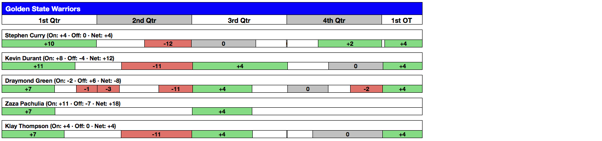

## Contents
{:.no_toc}
*  
{: toc}


```python
exec(open("Function.py").read())
%matplotlib inline
```


Here we create an instance Model from the class. We are only interested in working with data for 2018. Therefore, we can pull up only the data for Season 2018. We then build the dataframe we will be working with by calling the BuildDF function.


```python
Model=NBAWinProbability(Seasons=[2018])
Model.BuildDF()
Model.TrainTestSplit(train_fraction=0)
```


    Build DF Completed!
    Train-Test Split Completed!


Here we load the `.pkl` model for the 2012-17 seasons trained model. Note: we are not traning on 2018 and throught this part we are evaluating 2018 as a test perditction. All of the work we do here is assuming the model has never seen this data prior.


```python
Model.loadModelPersist('2012-17Model.pkl')
```


```python
Model.DownloadPlayerOnCourtInfo()
```


    Dowloading On Court Player information Completed!


The way we evaluate players perfomance is based on the model prediction for win probability. 

### 1. Downloading Players on Court Data
In order to obtain the players on court data we must do some web-scraping and interpreting of tables. We go through all of the games of the 2018 season and scape player on-court information from each game from websites like these: https://www.basketball-reference.com/boxscores/plus-minus/201711290LAL.html



From a website like this, we go through each div class of a row and obtain the **pixel** information of how large a given range a player was on court. Then, we convert this pixel infromation into a linear map and interpolate between points to obtain the best continuous function for the game time we can get. We then save that into a .csv file that contains each players amount of time on court for each game. More specifically in this .csv file we store the players on court every **5 second** for every player for every game. The player features are designed as -1 if they are playing in the home side team and 1 if they are playing in the away team.

Furthermore, we obtain the data on which players are on the court at all times. 

### 2. Interpolate the win probability
We already have the predicted win probability for each game at each event. But the time interval between each event does not much the time interval for the players on court data we have. Therefore we interpolate the win probability array for each game to obtain the win probablity at every 5 second interval, so WP matches with play on court data frame. 

### 3. Predict with linear regression model
The player information is not used in the prediction for the win probability. Instead we join this information from both sources to make up the ranking of each of the players. We obtain the change in win probability for each time and check which players are on court and attribute the change in winning probability to the change in players on the court. We learn a linear regression model on the winning probability output of the logistic regression model and output. The linear regression model takes as input the one-hot vectors of which players are on the court at any given time. It is important to note that the player features are designed as -1 if they are playing in the home side team and 1 if they are playing in the away team. If a player is not playing at an instance of time, their value will be denoted by 0. By doing this we are considering the strength of one team's opponent. The linear regression is learned using this scheme and the **coefficents of the predictors** indicate how valuable the player is in changing the win probability. We extract the values of the coeficients for the linear regression model and rank them based on magnitude. It is also worth mentioning that the code is smart enough to consider overtime correctly.

To achive the above goal we call on the function `WP_list()` to generate the win probability prediction for all time of all games in 2018. We then generate the player ranking using the `player_ranking()` function which generates a ranked DataFrame containing all players and their ranked performance using the metric mentioned above.


```python
Model.WP_list()
rank=Model.player_ranking()
```


If we look at the Dataframe, we can see the top most valuable players including LeBron James and Giannis Antetokounmpo. This is indicative that when they are on court, their actions largely contribute to increasing the winning probability of the team. Note that here the criterion of measure a players ability is through the changes of WP influenced by that player. In another word, it measures a player's ability to turn the process of a game. It might be successful screens, high level covering defense, or just boost morale of his teammates. None of these can be captured by existing tranditional stats, because they are not and not possible to be recorded. 


```python
rank.head(20)
```


<div>
<style>
    .dataframe thead tr:only-child th {
        text-align: right;
    }

    .dataframe thead th {
        text-align: left;
    }

    .dataframe tbody tr th {
        vertical-align: top;
    }
</style>
<table border="1" class="dataframe">
  <thead>
    <tr style="text-align: right;">
      <th></th>
      <th>coef</th>
      <th>time</th>
      <th>total</th>
      <th>name</th>
      <th>Rank</th>
    </tr>
  </thead>
  <tbody>
    <tr>
      <th>0</th>
      <td>0.002734</td>
      <td>8502.0</td>
      <td>23.246689</td>
      <td>Jeff Teague</td>
      <td>1.0</td>
    </tr>
    <tr>
      <th>1</th>
      <td>0.001728</td>
      <td>8870.0</td>
      <td>15.326443</td>
      <td>Otto Porter</td>
      <td>2.0</td>
    </tr>
    <tr>
      <th>2</th>
      <td>0.002961</td>
      <td>5149.0</td>
      <td>15.246939</td>
      <td>Tyus Jones</td>
      <td>3.0</td>
    </tr>
    <tr>
      <th>3</th>
      <td>0.001942</td>
      <td>7071.0</td>
      <td>13.731552</td>
      <td>Joel Embiid</td>
      <td>4.0</td>
    </tr>
    <tr>
      <th>4</th>
      <td>0.001295</td>
      <td>10572.0</td>
      <td>13.687375</td>
      <td>LeBron James</td>
      <td>5.0</td>
    </tr>
    <tr>
      <th>5</th>
      <td>0.001475</td>
      <td>9272.0</td>
      <td>13.673057</td>
      <td>Giannis Antetokounmpo</td>
      <td>6.0</td>
    </tr>
    <tr>
      <th>6</th>
      <td>0.001330</td>
      <td>9946.0</td>
      <td>13.225438</td>
      <td>Bradley Beal</td>
      <td>7.0</td>
    </tr>
    <tr>
      <th>7</th>
      <td>0.001338</td>
      <td>9854.0</td>
      <td>13.185781</td>
      <td>Taj Gibson</td>
      <td>8.0</td>
    </tr>
    <tr>
      <th>8</th>
      <td>0.001371</td>
      <td>9416.0</td>
      <td>12.909097</td>
      <td>James Harden</td>
      <td>9.0</td>
    </tr>
    <tr>
      <th>9</th>
      <td>0.001432</td>
      <td>8874.0</td>
      <td>12.711584</td>
      <td>Al Horford</td>
      <td>10.0</td>
    </tr>
    <tr>
      <th>10</th>
      <td>0.001430</td>
      <td>8618.0</td>
      <td>12.322240</td>
      <td>Robert Covington</td>
      <td>11.0</td>
    </tr>
    <tr>
      <th>11</th>
      <td>0.001777</td>
      <td>6823.0</td>
      <td>12.122346</td>
      <td>Garrett Temple</td>
      <td>12.0</td>
    </tr>
    <tr>
      <th>12</th>
      <td>0.001292</td>
      <td>9218.0</td>
      <td>11.912959</td>
      <td>Brandon Ingram</td>
      <td>13.0</td>
    </tr>
    <tr>
      <th>13</th>
      <td>0.001570</td>
      <td>7106.0</td>
      <td>11.156157</td>
      <td>Kristaps Porzingis</td>
      <td>14.0</td>
    </tr>
    <tr>
      <th>14</th>
      <td>0.001794</td>
      <td>6192.0</td>
      <td>11.106574</td>
      <td>Enes Kanter</td>
      <td>15.0</td>
    </tr>
    <tr>
      <th>15</th>
      <td>0.001040</td>
      <td>10376.0</td>
      <td>10.788628</td>
      <td>Jrue Holiday</td>
      <td>16.0</td>
    </tr>
    <tr>
      <th>16</th>
      <td>0.001612</td>
      <td>6685.0</td>
      <td>10.779440</td>
      <td>Wesley Johnson</td>
      <td>17.0</td>
    </tr>
    <tr>
      <th>17</th>
      <td>0.001171</td>
      <td>9123.0</td>
      <td>10.686375</td>
      <td>LaMarcus Aldridge</td>
      <td>18.0</td>
    </tr>
    <tr>
      <th>18</th>
      <td>0.001281</td>
      <td>8340.0</td>
      <td>10.680582</td>
      <td>Gary Harris</td>
      <td>19.0</td>
    </tr>
    <tr>
      <th>19</th>
      <td>0.001428</td>
      <td>7465.0</td>
      <td>10.657868</td>
      <td>Eric Gordon</td>
      <td>20.0</td>
    </tr>
  </tbody>
</table>
</div>


